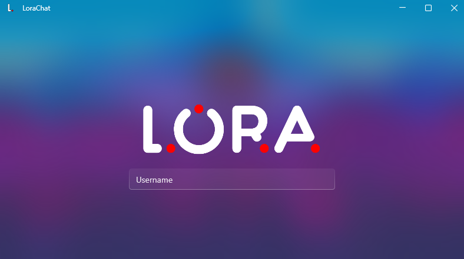

# LoRa Chat

  

  
  
  
  
  
  

## About

LoRa Chat is a messaging application that enables communication over LoRa networks. This project was developed during a three-month Software Engineering and Scrum-focused college project by a team of four developers: Juwan Jouma, Joulian Alsuliman, Sergej Jahne, and Ilja Groo.

**Key Features**: The application allows users to create chats, send and receive encrypted messages over LoRa networks, and manage connections with LoRa devices.

## Features

- Secure messaging over LoRa networks
- End-to-end encryption for messages
- User-friendly chat interface
- Device connection management
- System tray notifications
- Friend request functionality
- Message history and chat management

## Technologies

- **WPF**: Windows Presentation Foundation for building the desktop UI
- **C#**: Primary programming language
- **Arduino/C**: Programming language for LoRa communication
- **LoRa**: Long Range Communication technology for wireless communication
- **Entity Framework Core**: ORM for database operations
- **SQLite**: Lightweight database for storing chat and user information
- **WPF-UI**: Modern UI components for WPF
- **System.IO.Ports**: For serial communication with LoRa devices

## Getting Started

### Prerequisites

- Windows 11
- .NET SDK 8.0 or higher
- Visual Studio 2022 or Visual Studio Code
- LoRa hardware device (for full functionality)

### Installation

1. Clone the repository
2. Open the solution in Visual Studio
3. Restore NuGet packages
4. Run the application

## See it in Action

  
   
  <em>First Time Setup - Enter your nickname to start using the application</em>

  
   
  <em>Main Chat Interface - Send and receive messages over LoRa</em>

  
   
  <em>Private Messaging - Start secure conversations with other users</em>

  
   
  <em>Private Chat Window - Exchange messages in a dedicated private chat</em>

  
   
  <em>Encryption Key Setup - Configure end-to-end encryption for private chats</em>

  
   
  <em>Device Connection Status - Real-time LoRa device connectivity monitoring</em>

  
   
  <em>System Tray Notifications - Stay updated with message alerts</em>

## Project Structure

  - **Assets**: Application resources including images, styles and themes
  - **Data**: Database layer for data persistence
    - **Models**: Entity models for users, chats, messages and LoRa devices
    - **Repositories**: Data access layer implementing CRUD operations
  - **Logic**: Core business logic implementation
    - **Managers**: Services handling chat operations, client management, message encryption and LoRa communication
  - **Presentation**: User interface components
    - **Controls**: Custom WPF controls for chat bubbles and message displays
    - **Pages**: Main application pages including chat, settings and device management
    - **Views**: Window definitions and UI components for the application

## Contributors

  
  
  
  

